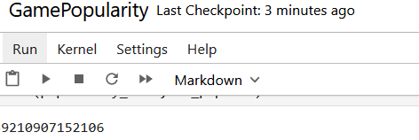

# SETUP
Après création de votre environnement virtuel:
> pip install -r requirements.txt

Vous pouvez ensuite lancer la commande `jupyter notebook` dans votre terminal. \
Vous êtes invité à choisir un fichier. Cliquez sur le fichier appelé `GamePopularity.ipynb`\
Vous pouvez ensuite cliquer sur le bouton avec deux triangles (voir capture d'écran) pour lancer tout le notebook et vérifier que tout fonctionne correctement.
